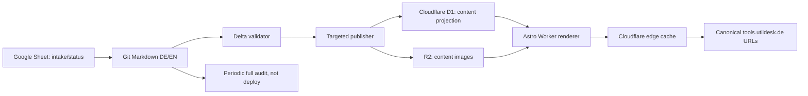

# План переноса Utildesk на точечную публикацию

Статус: план реализации, без production-изменений  
Дата: 2026-07-14  
Область: карточки инструментов, изображения, главная, Tool-Index, машинные зеркала и компактные sitemap

## 1. Решение

Сначала переносим delivery-архитектуру, затем продолжаем редактуру карточек.
Завершать ручную редактуру всех 1228 активных инструментов до миграции не
нужно. Содержание Markdown при переносе не переписывается: меняется только
способ публикации и отдачи HTML.

Целевой рабочий поток для изменения десяти карточек:

1. Редактор меняет десять DE/EN-пар Markdown и связанные изображения.
2. Проверки запускаются только для изменённых пар плюс быстрые глобальные
   инварианты.
3. Publisher делает двадцать D1-upsert и при необходимости загружает десять
   изображений.
4. Worker начинает отдавать новые ревизии по тем же canonical URL.
5. Выполняются live-check и IndexNow только изменённых canonical HTML URL.
6. Остальные карточки не рендерятся, не записываются и не загружаются.

Полный статический Astro build после завершения миграции не должен быть частью
обычного content-release.

## 2. Текущее состояние

- Публичный каталог содержит 1228 активных карточек и две локали.
- Обычный `astro build` повторно выполняет `getStaticPaths()` для всего дерева и
  создаёт около 3500 HTML/JSON/Markdown-маршрутов.
- Cloudflare дедуплицирует одинаковые загружаемые blobs, но это не отменяет
  локальную генерацию всех страниц Astro.
- Ratgeber уже работает через production D1/Worker и Pages middleware proxy.
- `site/scripts/runtime-content.mjs` уже сериализует `kind=tool`, но production
  Worker пока рендерит только Ratgeber.
- Текущий runtime publisher делает upsert, но ещё не имеет полного контракта
  удаления, деактивации и reconcile.
- Текущий exporter пропускает файлы с `_`, но должен дополнительно исключать
  `disabled`, `draft`, `active:false`, BLACKLIST и другие непубличные состояния.
- Главная, Tool-Index, tool detail, tool API и Markdown-зеркала пока остаются в
  статическом Pages deployment.

Источники истины после миграции:

- Google Sheet: приём кандидатов, статусы и решения publish/reject/blacklist.
- `content/tools` и `content/en/tools`: опубликованный редакционный источник.
- Git: аудит изменений, история и восстановление.
- D1: производная runtime-проекция для чтения, но не новый редакционный источник.
- R2/asset storage: производная публикационная копия изображений.

## 3. Цели и ограничения

### Цели

- Изменение карточек не запускает полный Astro build.
- Изменение главной или Tool-Index не пересобирает tool detail pages.
- Изменение шаблона карточки требует только маленького Worker build.
- Все публичные URL, canonical, hreflang и поисковая политика сохраняются.
- Карточки можно исправлять по одной, десятками или сотнями без разницы для
  остальных страниц.
- Любой этап имеет проверяемый rollback.

### Не входит в миграцию

- Массовое автоматическое выставление `editorial_reviewed:true`.
- Завершение ручной редактуры всех карточек.
- Расширение Google/Bing sitemap.
- Смена домена или URL-структуры.
- Отказ от Markdown и Git.
- Одновременная миграция всех маршрутов без preview и allowlist.

## 4. Целевая архитектура



Pages остаётся оболочкой и обратимым proxy-контуром на переходном этапе.
Runtime Worker получает только выбранные группы URL. После полного перехода
старый статический каталог сохраняется в отдельном frozen fallback deployment,
а не пересобирается при каждом релизе.

## 5. Типы релизов после переноса

| Изменение | Целевое действие | Полный static build |
| --- | --- | --- |
| Текст 1-100 карточек | Проверка delta + D1 upsert DE/EN | Нет |
| Новая/заменённая иллюстрация | Upload в R2 + D1 revision | Нет |
| Шаблон tool detail | Runtime Worker build/deploy | Нет |
| Главная или Tool-Index | Build/deploy соответствующего runtime-кластера | Нет |
| Ratgeber-текст | Существующий D1 upsert | Нет |
| Глобальная Pages middleware/headers | Маленький Pages shell release | Возможно |
| Общий дизайн всех кластеров | Runtime builds затронутых кластеров + широкая QA | Не обязательно |
| Изменение legacy static-only маршрута | Временный static build до его миграции | Да |

## 6. Этап 0. Зафиксировать baseline и rollback

Перед первой реализацией:

1. Создать git tag текущего хорошего production commit.
2. Зафиксировать Cloudflare Pages deployment ID и Worker deployment ID.
3. Экспортировать production D1 в датированный backup.
4. Создать отдельный frozen Pages fallback из текущего `site/dist`.
5. Сохранить списки активных DE/EN tool slugs и их HTTP/SEO-характеристики.
6. Снять контрольные HTML-снимки минимум для 24 разных карточек:
   - редакционная и автоматическая;
   - с иллюстрацией и без;
   - с альтернативами и без;
   - с Ratgeber backlinks;
   - tier A/B/C/D;
   - explicit index/noindex;
   - длинная и короткая карточка;
   - обе локали и мобильный viewport.
7. Сохранить live baseline для canonical, hreflang, robots, googlebot,
   JSON-LD, alternate JSON/Markdown и status code.

Критерий: rollback не зависит от наличия файлов старой страницы в следующем
Pages deployment.

## 7. Этап 1. Сделать tool publisher безопасным

Это обязательный этап до загрузки всех карточек в production D1.

### 7.1 Публичность записи

Добавить единый `isPublishableTool()` и использовать его в static routes,
runtime exporter, sitemap и API. Он должен исключать:

- имя файла начинается с `_`;
- `disabled:true`;
- `draft:true`;
- `active:false`;
- Sheet-статусы BLACKLIST, DUPLICATE и REJECTED, если они отражены в проекции;
- зарезервированные slugs и alias-only entries.

Нельзя иметь отдельные слегка разные определения active в нескольких скриптах.

### 7.2 D1 schema v2

Добавить materialized поля, необходимые для безопасных запросов:

- `is_active`;
- `route_state` (`active`, `redirect`, `disabled`, `tombstone`);
- `canonical_path`;
- `robots_policy`;
- `googlebot_policy`;
- `editorial_reviewed`;
- `illustration_path`;
- `source_commit`;
- `source_hash` и `revision` уже используются;
- `deleted_at` для tombstone.

Добавить индексы `(kind, locale, is_active, slug)` и по полям, используемым
Tool-Index. `metadata_json` остаётся полной копией frontmatter, но критичные
фильтры не должны зависеть от JSON-поиска.

### 7.3 Парные и атомарные публикации

- DE и EN одной карточки публикуются одним release unit.
- Отсутствующая EN-версия блокирует production upsert, если карточка не имеет
  явного разрешённого исключения.
- SQL выполняется транзакционно для всей партии.
- Неизменившийся `source_hash` не повышает revision и не переписывает запись.
- Publisher поддерживает `--slug`, `--slugs-file`, `--git-range`, `--dry-run` и
  `--production` с явным подтверждением.
- Dry-run выводит только slugs, операции и проверки, но не секреты и не полный
  текст карточек.

### 7.4 Удаление и reconcile

Добавить три операции:

- `deactivate`: перестать отдавать карточку, сохранив историю;
- `redirect`: вернуть постоянный redirect на canonical replacement;
- `reconcile`: сравнить Git public set с D1 и показать лишние/пропущенные записи.

Bulk reconcile сначала работает только в dry-run. Автоматическое физическое
удаление записей запрещено; production использует tombstone/redirect.

### 7.5 Проверки publisher

До записи D1 проверять:

- обе локали и совпадение slug;
- frontmatter и public-state;
- внутренние alternative links ведут на активные slugs;
- отсутствуют 404-ссылки на собственные карточки;
- editorial figure ссылается на существующий asset;
- canonical path уникален;
- поисковое решение совпадает с `searchIndexPolicy.mjs`;
- HTML-опасные конструкции и сломанный Markdown;
- source commit является ожидаемым clean release commit.

## 8. Этап 2. Runtime tool renderer

### 8.1 Не копировать логику двух старых страниц

Сначала извлечь из статических DE/EN tool routes чистую общую модель:

- нормализация metadata;
- editorial/automatic classification;
- verdict;
- извлечение иллюстрации;
- H2/FAQ;
- alternatives;
- guide backlinks;
- price/category/tags;
- robots/googlebot decision;
- JSON-LD;
- locale labels и URL.

Создать общий модуль вида `buildToolDetailViewModel(entry, locale, context)`.
Static и runtime renderer временно должны использовать одну модель, чтобы
snapshot-сравнение выявляло только разницу оболочки, а не бизнес-логики.

### 8.2 Runtime routes

Добавить в `site/runtime-src`:

- `/tools/[slug]/`;
- `/en/tools/[slug]/`;
- preview-варианты под `/runtime-preview/...`;
- `RuntimeToolDetail.astro`;
- tool-specific cache version.

Обязательный HTML-паритет:

- status 200/301/404/410;
- self-canonical;
- DE/EN hreflang и `x-default`;
- title/description;
- generic robots и отдельный googlebot meta;
- SoftwareApplication и Breadcrumb JSON-LD только там, где это разрешено;
- JSON/Markdown alternate links;
- provider link policy;
- изображение, alt, width/height и lazy/eager policy;
- альтернативы только на существующие активные карточки;
- обратные ссылки на Ratgeber;
- FAQ и jump navigation;
- отсутствие плашки «не проверено» у реально editorial-reviewed карточек;
- текущая desktop/mobile визуальная система.

### 8.3 Cache contract

Ключ detail-page cache:

`renderer_version + locale + slug + source_hash + revision`

- Новый текст получает новый cache key без purge всего сайта.
- Изменение шаблона меняет `renderer_version` один раз.
- HTML: `s-maxage=300`, `stale-while-revalidate=86400`.
- 404 и redirect получают отдельные короткие cache policies.
- Response headers показывают runtime cluster, revision и HIT/MISS без утечки
  внутренних данных.

## 9. Этап 3. Изображения без Pages build

Не нужно ждать миграции всех 1146 существующих иллюстраций.

1. Создать R2 bucket для content assets и binding для runtime Worker.
2. Оставить старые `/images/tools/*` в Pages как fallback.
3. Новые и заменённые изображения загружать в R2 напрямую.
4. Использовать content-addressed filenames для новых версий, например
   `<slug>-editorial-<short-hash>.webp`.
5. Записать новый путь в Markdown и D1 в одной release operation.
6. Проверять MIME, размеры, aspect ratio, реальный decode и максимальный вес.
7. Проксировать `/images/tools/*` сначала в R2, затем fail-open в Pages assets.
8. Старые изображения переносить фоновым reconcile, а не блокирующей массовой
   операцией.

Это устраняет cache-busting вручную и отдельную полную сборку ради одного WebP.

## 10. Этап 4. Preview и автоматический паритет

До production proxy:

1. Импортировать все активные DE/EN tool entries в preview D1.
2. Запустить reconcile: Git public set = preview D1 active set.
3. Для контрольных 24 карточек сравнить static и runtime:
   - status;
   - canonical/hreflang;
   - robots/googlebot;
   - title/description;
   - JSON-LD types и ключевые поля;
   - количество H2, FAQ, alternatives, guide backlinks и figures;
   - все внутренние URL;
   - изображения HTTP 200;
   - отсутствие горизонтального overflow на 390 px;
   - desktop screenshots.
4. Выполнить crawl всех preview tool routes.
5. Проверить D1 cold read, cache MISS/HIT и upstream failure.
6. Проверить, что preview всегда `noindex` и не попадает в sitemap.

Порог перехода: ноль критических SEO/route ошибок и ноль неизвестных 404.

## 11. Этап 5. Постепенное production-переключение

Pages middleware получает отдельные настройки:

- `content-runtime:tools=off|allowlist|on`;
- `content-runtime:tools:allowlist=<JSON slugs>`;
- отдельный header `X-Utildesk-Content-Runtime: tools-v1`.

Порядок:

1. 20 репрезентативных карточек, а не только лучшие карточки.
2. Наблюдение минимум за двумя полными обходами live-check.
3. 100 карточек и повторный полный контроль.
4. Все active DE/EN detail routes.
5. Отдельно redirects/tombstones.

На каждом шаге:

- Worker 404 или exception вызывает fallback на frozen/static origin;
- kill switch выключает только tool runtime, не Ratgeber;
- canonical URL не меняется;
- в compact sitemap не добавляются новые long-tail URL;
- IndexNow отправляется только для реально изменённых canonical страниц.

## 12. Этап 6. Удалить tool detail из полного Astro build

Только после полного production-паритета:

1. Убрать static `getStaticPaths()` для DE/EN tool detail из обычного build tree.
2. Удалить требование `check_built_tool_routes.mjs`, что все 1228 карточек должны
   существовать в `site/dist`; заменить его runtime route/D1 guard.
3. Сохранить frozen fallback deployment и документированную команду rollback.
4. Проверить, что новый Pages build не удаляет доступ к fallback-origin.
5. Измерить новое число статических страниц и время сборки.

После этого изменение главной или индекса физически не сможет пересобрать tool
detail pages: их больше не будет в статическом route tree.

## 13. Этап 7. Машинные зеркала и поиск

Перенести в runtime:

- `/api/tools.json` и `/en/api/tools.json`;
- `/api/tools/[slug].json` и EN;
- `/markdown/tools/[slug].md` и EN.

Требования:

- endpoints читают только active entries;
- сохраняют `X-Robots-Tag: noindex`;
- полный catalog JSON кешируется с aggregate revision/ETag;
- detail mirrors используют ту же source revision, что HTML;
- поиск получает полный обновлённый индекс сразу после D1 upsert;
- inactive/tombstone entries исчезают из каталога синхронно с HTML;
- контракт `check:search` продолжает проходить.

`feed`, `llms` и категории можно переносить позже, но они должны либо читать D1,
либо явно иметь документированную допустимую задержку.

## 14. Этап 8. Главная, Tool-Index и категории

Чтобы изменение главной или индекса не запускало legacy build:

1. Создать отдельный runtime shell cluster для `/`, `/en/`, `/tools/` и
   `/en/tools/`.
2. Главная получает counts/latest/focus data из D1, а Ratgeber-блок из
   существующего runtime-источника.
3. Tool-Index серверно отдаёт компактные 36 карточек, а полный поиск и фильтры
   используют runtime `/api/tools.json`.
4. Сохранить текущий query contract, canonical cleanup и отсутствие декоративного
   поиска.
5. Category/tag pages на первом шаге могут оставаться static, но их counts нельзя
   считать мгновенно актуальными.
6. Затем перевести категории и теги в runtime либо сделать их D1-кешированными
   представлениями.

После этого homepage/index design release — маленький Worker deploy, а не сборка
каталога.

## 15. CI и проверки после миграции

### На каждый content commit

- определить изменённые slugs через git diff;
- проверить только их DE/EN-контент и assets;
- выполнить быстрые глобальные проверки slug uniqueness, public-state и ссылок;
- dry-run D1 operations;
- запретить полный Astro build в content-only workflow.

### На runtime renderer commit

- build runtime Worker;
- unit/snapshot tests view model;
- preview crawl и визуальный smoke test;
- deploy Worker без Pages build.

### Периодически, но не в content deploy

- полный editorial audit 1228 карточек;
- Git/D1 reconcile;
- полный broken-link и image audit;
- sitemap/robots/GSC/Bing contract;
- D1 backup;
- fallback restore drill.

Полный audit остаётся полезным контролем качества, но перестаёт быть способом
публикации каждого абзаца.

## 16. Новый production release-flow

Предлагаемый единый wrapper:

```text
tool-runtime-release --git-range <base>..<head> --production
```

Он должен:

1. Показать изменённые DE/EN slugs и assets.
2. Остановиться при unrelated dirty files.
3. Проверить карточки по `utildesk-tool-editorial` contract.
4. Проверить ссылки и public-state.
5. Загрузить новые content-addressed изображения.
6. Выполнить атомарный D1 upsert/deactivate/redirect.
7. Проверить HTML, JSON, Markdown и изображения live.
8. Сравнить source hash с D1 revision.
9. Отправить IndexNow для изменённых canonical HTML URL.
10. Записать компактный release report.

Пример результата для десяти карточек: 20 locale entries, до 10 assets, 20 live
HTML checks; ноль сгенерированных неизменённых страниц.

## 17. Rollback

Rollback имеет три уровня:

1. **Одна карточка:** повторный upsert предыдущей Git-ревизии.
2. **Worker renderer:** rollback на предыдущий Worker deployment.
3. **Весь tool runtime:** KV kill switch и переключение на frozen fallback origin.

Дополнительно:

- D1 backup создаётся перед bulk import/reconcile.
- R2 assets не удаляются в том же release, где на них перестали ссылаться.
- Tombstone можно отменить предыдущей активной ревизией.
- Ratgeber имеет независимый kill switch и не должен затрагиваться.
- Нельзя удалять static fallback до успешной учебной процедуры восстановления.

## 18. Метрики готовности

Миграция считается завершённой, когда выполняются все условия:

- 1228 active DE entries и все ожидаемые EN siblings согласованы с D1.
- Ноль runtime 404 для active slugs.
- Ноль canonical/hreflang/robots/googlebot расхождений.
- Ноль битых illustration references и internal alternatives.
- Compact sitemap сохраняет текущую глубинную стратегию.
- Горячий HTML cache p95 не хуже 250 мс; холодный p95 не хуже 1000 мс.
- Content-only release не запускает `astro build` и не создаёт `site/dist`.
- Обновление 1-100 карточек публикует только delta.
- Изменение tool template выполняет только runtime build.
- Изменение главной или Tool-Index не обходит и не компилирует tool details.
- Kill switch и восстановление из frozen fallback реально проверены.
- Git остаётся воспроизводимым источником для полной реконструкции D1.

## 19. Рекомендуемый порядок реализации

1. Baseline, D1 backup и frozen fallback.
2. Единый public-state helper.
3. D1 schema v2, atomic publisher, deactivate/redirect/reconcile.
4. Общий tool view model.
5. Preview runtime DE/EN tool details.
6. Автоматический HTML/SEO/visual parity suite.
7. R2 asset path с Pages fallback.
8. Production allowlist: 20 карточек.
9. Production allowlist: 100 карточек.
10. Все active tool detail routes.
11. Удаление static tool detail generation.
12. Runtime API/Markdown/search endpoints.
13. Runtime homepage и Tool-Index.
14. Category/tag migration.
15. Удаление оставшихся ненужных legacy build-зависимостей.

До пунктов 8-10 редакционная кампания может продолжаться в отдельных worktree,
но массовый production deploy старым способом лучше приостановить. После пункта
10 вся дальнейшая редактура должна публиковаться только delta-flow.

## 20. Первый безопасный implementation slice

Первый технический change-set не переключает production. В него входят только:

- общий `isPublishableTool()`;
- D1 migration v2;
- dry-run/reconcile publisher;
- `buildToolDetailViewModel()`;
- preview DE/EN tool routes;
- parity tests на контрольной выборке;
- документация rollback.

Только после зелёного preview-а отдельным change-set включается production
allowlist. Это разделяет разработку, импорт данных и боевое переключение и не
повторяет проблему, когда большой архитектурный патч одновременно меняет дизайн
и production-routing.
